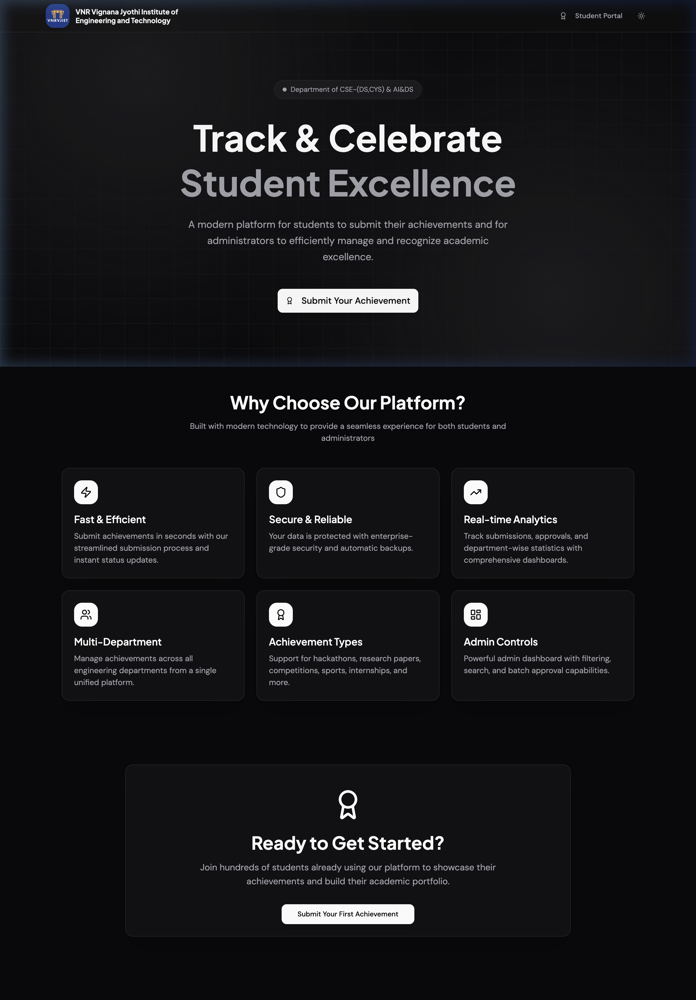
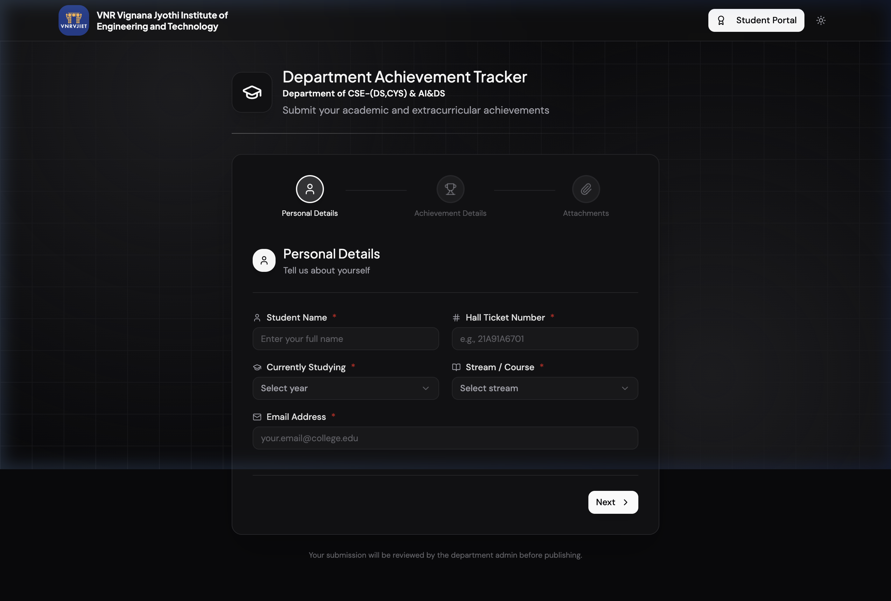
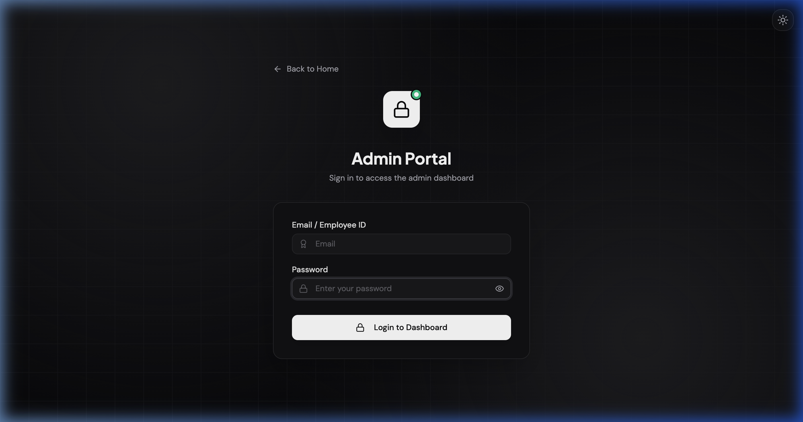
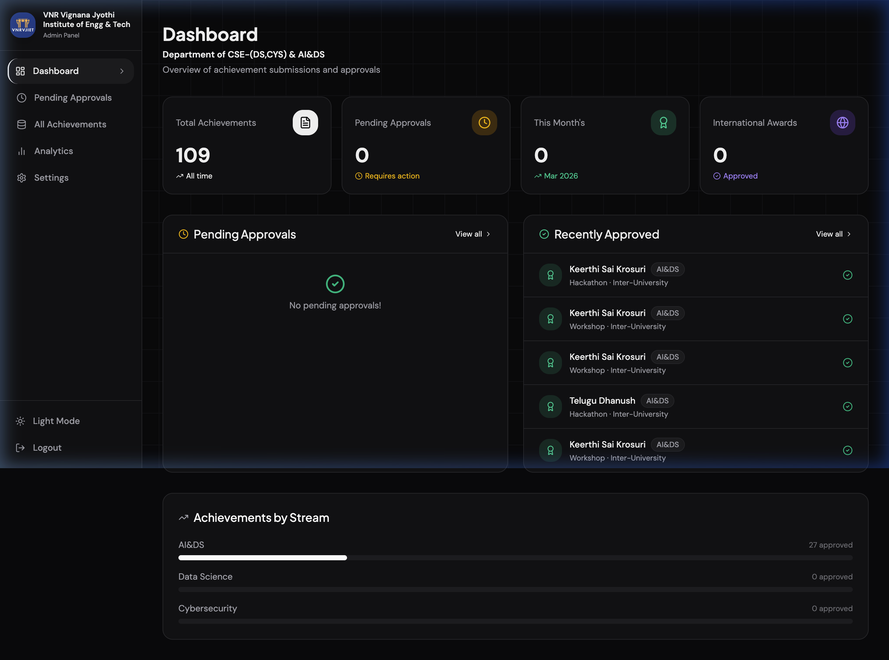
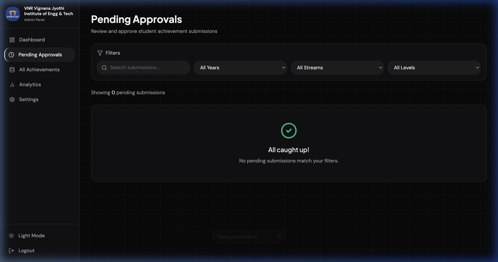
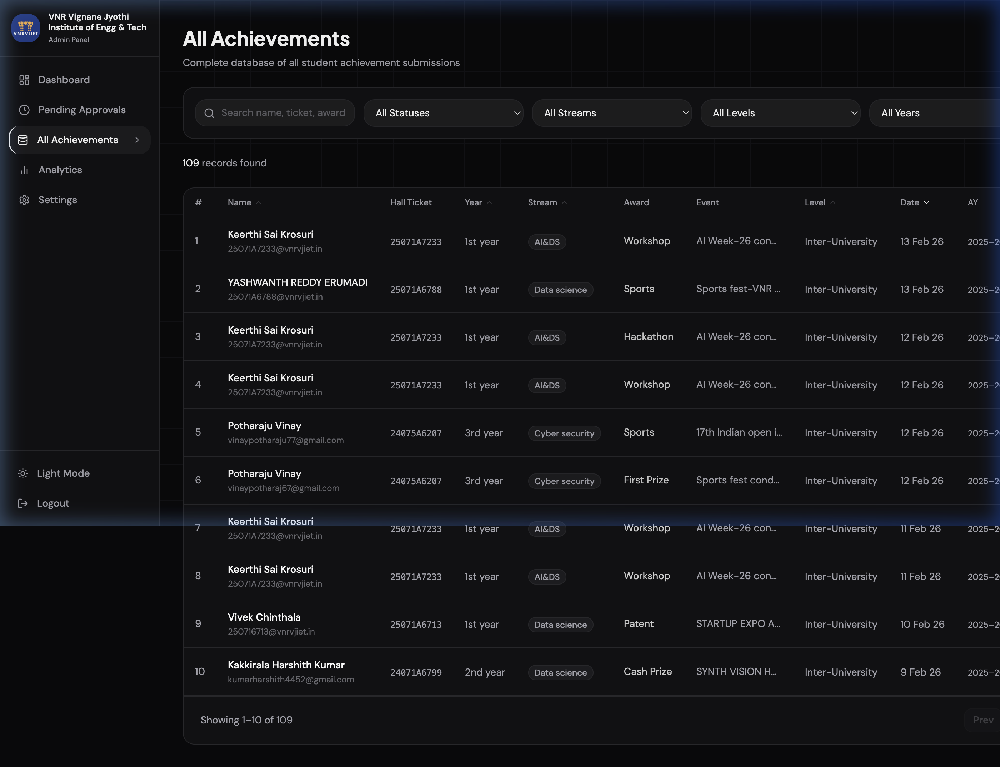
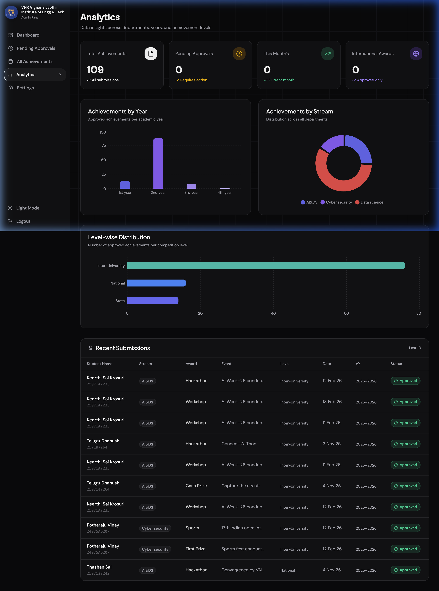
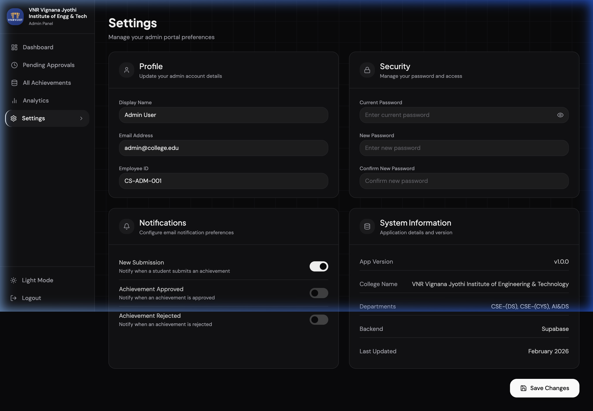

# Department Achievement Tracker

A modern web platform for students to submit their academic achievements and for administrators to efficiently manage, review, and analyze records — built for the **Department of CSE-(DS,CYS) & AI&DS** at **VNR Vignana Jyothi Institute of Engineering and Technology**.

---

## 📸 Screenshots

### 🏠 Home Page


### 🎓 Student Portal


### 🔐 Admin Login


### 📊 Admin Dashboard


### ⏳ Pending Approvals


### 🏆 All Achievements


### 📈 Analytics


### ⚙️ Settings


---

## ✨ Features

### Student-Facing
- **Achievement Submission Form** — Students can submit achievements with details like name, roll number, stream, year, event, award, level, and date
- **Image Upload** — Upload proof of achievement (PNG, JPG, JPEG) stored in Supabase Storage
- **Academic Year Auto-Detection** — Records are automatically grouped by academic year (April–March cycle)

### Admin Panel
- **Dashboard** — Overview of total achievements, pending approvals, this month's stats, and international awards; shows recent submissions and breakdowns by stream
- **Pending Approvals** — Review and approve or reject incoming student submissions with evidence preview
- **All Achievements** — Searchable and filterable table of all records with the ability to delete entries
- **Analytics** — Visual charts for achievements by year, by stream (donut chart), and by competition level (bar chart)
- **Settings** — Admin configuration panel
- **Dark / Light Mode** — Toggle between themes across the entire app

---

## 🛠️ Tech Stack

| Layer | Technology |
|-------|------------|
| Framework | React 18 + TypeScript |
| Build Tool | Vite 6 |
| Styling | Tailwind CSS v4 |
| UI Components | Radix UI + shadcn/ui |
| Charts | Recharts |
| Routing | React Router v7 |
| Backend / DB | Supabase (PostgreSQL) |
| Storage | Supabase Storage |
| Animations | Motion (Framer Motion) |
| Icons | Lucide React |

---

## 🚀 Getting Started

### Prerequisites
- Node.js 18+
- A [Supabase](https://supabase.com) project (free tier works)

### 1. Clone and install dependencies

```bash
git clone <repository-url>
cd "Department Achievement Tracker"
npm install
```

### 2. Configure environment variables

Copy the example environment file and fill in your Supabase credentials:

```bash
cp .env.example .env
```

Edit `.env`:

```env
VITE_SUPABASE_URL=your_supabase_project_url
VITE_SUPABASE_ANON_KEY=your_supabase_anon_key
```

### 3. Set up the database

Run the SQL setup script in your Supabase SQL editor:

```bash
# Open supabase_setup.sql and execute it in Supabase Studio → SQL Editor
```

### 4. Start the development server

```bash
npm run dev
```

The app will be available at `http://localhost:5173`.

### 5. Build for production

```bash
npm run build
```

---

## 🔑 Admin Access

Navigate to `/adminaccess/login` to access the admin panel.

> Default credentials are configured in `src/app/context/AdminAuthContext.tsx`.

---

## 📁 Project Structure

```
src/
├── app/
│   ├── components/       # Reusable UI components (Layout, AdminLayout, etc.)
│   ├── context/          # React contexts (AdminAuth, Theme)
│   ├── lib/              # Supabase client and utilities
│   ├── pages/
│   │   ├── Home.tsx
│   │   ├── StudentPortal.tsx
│   │   ├── AdminLogin.tsx
│   │   └── admin/
│   │       ├── Dashboard.tsx
│   │       ├── PendingApprovals.tsx
│   │       ├── AllAchievements.tsx
│   │       ├── Analytics.tsx
│   │       └── Settings.tsx
│   └── routes.tsx
└── styles/               # Global CSS
```

---

## 🎨 Design

The original design is available on Figma:
[Department Achievement Tracker — Figma](https://www.figma.com/design/DoHhzATBSmvNWmdXvylynu/Department-Achievement-Tracker)

---

## 📄 Attributions

See [ATTRIBUTIONS.md](ATTRIBUTIONS.md) for third-party library credits.